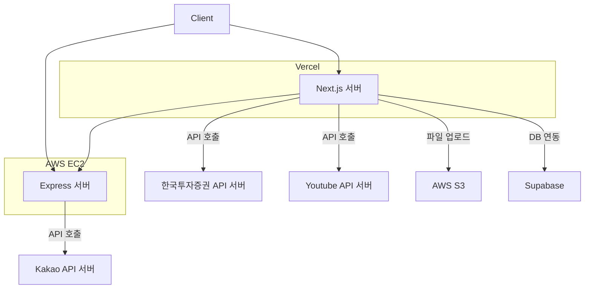

# 💰 Moneed

> **주식 투자 커뮤니티 플랫폼** - 투자자들이 모여 정보를 공유하고 소통할 수 있는 스마트한 공간

[](https://vercel.com)
[](https://nextjs.org)
[](https://typescriptlang.org)
[](https://prisma.io)
[](https://postgresql.org)

## 📋 목차

- [프로젝트 소개](#프로젝트-소개)
- [주요 기능](#주요-기능)
- [기술 스택](#기술-스택)
- [프로젝트 구조](#프로젝트-구조)

## 🚀 프로젝트 소개

**Moneed**는 주식 투자자들을 위한 종합적인 커뮤니티 플랫폼입니다. 사용자들이 주식 정보를 공유하고, 투자 의견을 나누며, 실시간으로 시장 동향을 파악할 수 있도록 돕습니다.

## ✨ 주요 기능

### 🏠 커뮤니티


- **Top 5**: 가장 인기 있는 종목 실시간 랭킹
- **지금 뜨는 종목**: 급상승 주식 추천
- **핫한 투표**: 커뮤니티 투표를 통한 시장 심리 파악 (예정)
- **인기 급상승 게시글**: 가장 활발한 토론 게시물
- **기업 데이터**: 기업 소개 및 실시간 주가 및 변동률 표시

### 💬 게시판


- **게시글 작성/수정/삭제**: 게시글 CRUD
- **댓글 시스템**: 실시간 댓글 기능
- **좋아요**: 게시글 좋아요 기능 
- **이미지 업로드**: AWS S3 연동 파일 저장
- **랭킹 시스템**: [랭킹 알고리즘](https://dkswnkk.tistory.com/738) 기반 인기 급상승 게시글 표시

### 👤 사용자 관리


- **카카오 OAuth 로그인**: 간편한 소셜 로그인
- **프로필 관리**: 닉네임, 프로필 이미지 설정
- **내 활동**: 내가 작성한 게시글/댓글 관리
- **회원 탈퇴**: 개인정보 보호를 위한 안전한 탈퇴

### 🎬 쇼츠 (Shorts)


- **동영상 콘텐츠**: YouTube API 연동을 통한 투자 관련 영상 제공
- **Cron Job을 이용한 일일 업데이트**(예정)

## 🛠 기술 스택

### Frontend

- **Framework**: Next.js 15 (App Router)
- **Language**: TypeScript
- **Styling**: Tailwind CSS 4
- **State Management**: Zustand
- **Data Fetching**: TanStack Query (React Query)
- **Form Handling**: React Hook Form

### Backend

- **Web App**: Next.js API Routes
- **Proxy Server**: Express.js (카카오 OAuth 처리)
- **Language**: TypeScript
- **Authentication**: JWT

### Database & ORM

- **Database**: PostgreSQL (Supabase)
- **ORM**: Prisma ORM

### External APIs

- **주식 데이터**: 한국투자증권 API
- **동영상 콘텐츠**: YouTube Data API v3
- **OAuth**: 카카오 로그인 API
- **파일 저장**: AWS S3

### DevOps & Deployment

- **Frontend**: Vercel
- **Backend**: AWS EC2
- **CI/CD**: GitHub Actions

### Development Tools

- **Package Manager**: Yarn (Workspaces)
- **Code Quality**: ESLint, Prettier
- **Git Hooks**: Husky, lint-staged
- **Type Checking**: TypeScript 

## 📁 프로젝트 구조

```
Moneed/
├── apps/                          # 애플리케이션들
│   ├── web/                       # Next.js 웹 애플리케이션
│   │   ├── app/                   # App Router 페이지
│   │   │   ├── api/               # API 라우트
│   │   │   ├── community/         # 커뮤니티 페이지
│   │   │   ├── posts/             # 게시글 페이지
│   │   │   ├── auth/              # 인증 페이지
│   │   │   └── ...
│   │   └── src/                   # 소스 코드
│   │       ├── entities/          # 도메인 엔티티
│   │       ├── features/          # 기능별 모듈
│   │       ├── screens/           # 페이지 컴포넌트
│   │       ├── shared/            # 공유 컴포넌트/유틸
│   │       └── app/               # 앱 설정
│   └── kakao-proxy-server/        # 카카오 OAuth 프록시 서버
│       └── src/
│           ├── api/               # 외부 API 호출
│           ├── middleware/        # Express 미들웨어
│           ├── routes/            # API 라우트
│           ├── service/           # 비즈니스 로직
│           ├── repository/        # 데이터 접근 계층
│           └── utils/             # 유틸리티 함수
├── packages/                      # 공유 패키지들
│   └── shared/
│       ├── auth/                  # 인증 관련 유틸
│       ├── utils/                 # 공통 유틸리티
│       └── utility-types/         # 타입 정의
├── docs/                          # 문서
│   └── CHANGELOG.md              # 배포 변경 내역
└── vercel.json                    # Vercel 설정
```

### 아키텍처 다이어그램



### 개발 가이드라인

- [Conventional Commits](https://www.conventionalcommits.org/) 규칙을 따릅니다
- 코드 작성 전 ESLint 및 Prettier 설정을 확인하세요
- 커밋 메시지는 한국어로 작성합니다

## 📞 문의

프로젝트에 대한 문의사항이나 버그 리포트는 [Issues](https://github.com/your-username/moneed/issues)를 통해 제출해 주세요.

---

**Moneed**와 함께 스마트한 투자를 시작하세요! 🚀
